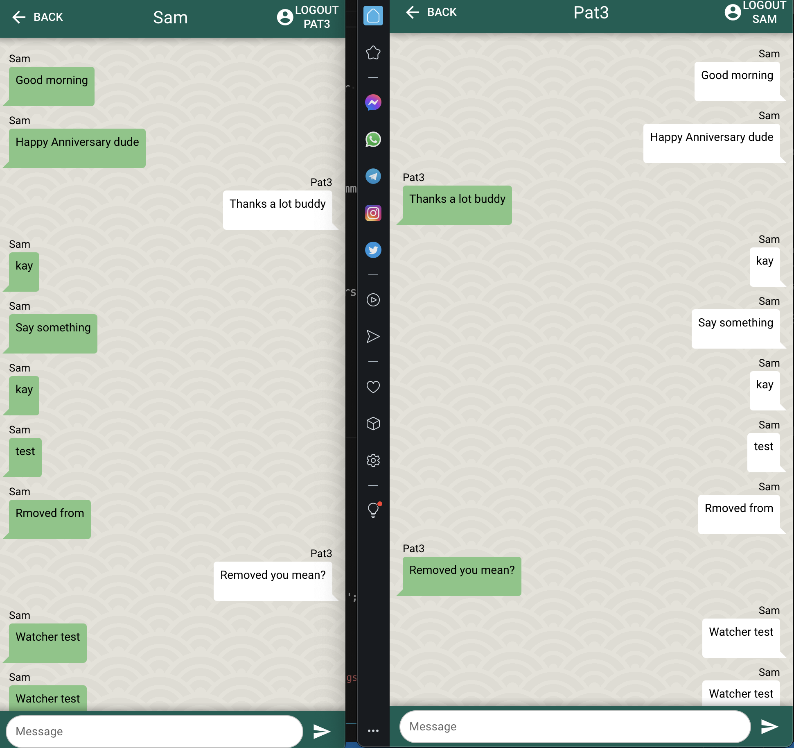

# QChat (qchat)

A Quasar Project

A cross-platform messenger app created with Quasar Framework v2, VueJS 3, Realtime Database from Firebase 9, Pinia, Vite.



## Setup Firebase
- Create a firebase config file by running the command:
```bash
   cp firebaseConfig.example.js firebaseConfig.js
```
- Create a new Firebase project named QChat
- Create a Web App named QChat
- Copy the config from the code sample that appears and add it to firebaseConfig.js
- Create a Realtime database
## Install the dependencies
```bash
yarn
# or
npm install
```

### Start the app in development mode (hot-code reloading, error reporting, etc.)
```bash
quasar dev
```


### Build the app for production
```bash
quasar build
```

### Customize the configuration
See [Configuring quasar.config.js](https://v2.quasar.dev/quasar-cli-vite/quasar-config-js).
